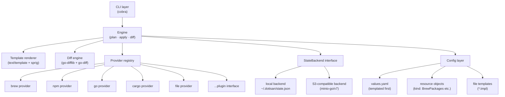
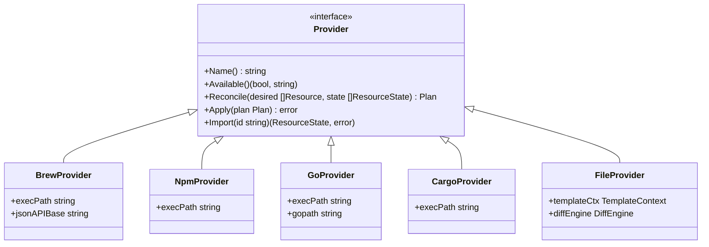
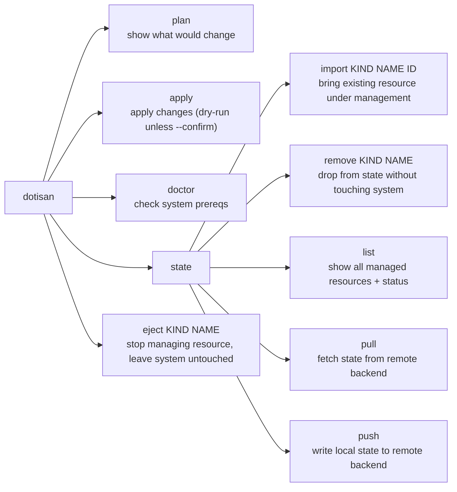
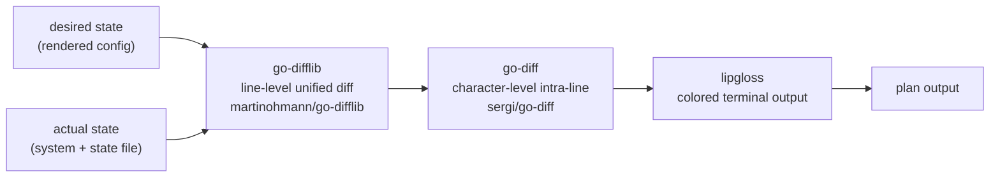

# dotisan — Project Specification Brief

> **Purpose of this document:** Input brief for `spec-workflow` agent to produce a full project specification. It describes the problem, goals, architecture, config format, provider system, state management, CLI surface, and recommended Go libraries.

---

## 1. Problem Statement

`chezmoi` and similar dotfile managers lack true declarative state — they apply changes forward but never clean up resources (files, packages) that are no longer declared. Managing packages (brew, npm, go, cargo), config files, Claude skills, MCP server definitions, and shell config across machines currently requires excessive shell script workarounds.

The goal is a purpose-built CLI tool written in Go that treats a local developer environment the same way Terraform treats cloud infrastructure: declare desired state in version-controlled config files, compute a diff against current state, and apply changes — including **removals**.

---

## 2. Design Principles

- **Declarative over imperative** — describe what should exist, not how to get there
- **Stateful** — track managed resources explicitly; removals are first-class operations
- **Dry-run by default** — `apply` shows a plan and requires `--confirm` to execute
- **Provider-based** — each resource type (brew, npm, file, …) is an isolated provider
- **Kubernetes-style config** — each resource is a typed YAML object with `apiVersion`, `kind`, `metadata`, `spec`
- **Helm-style templating** — `values.yaml` + Go templates + sprig functions
- **No locks** — single-user tool, lock files are unnecessary complexity

---

## 3. Architecture



---

## 4. Config Format

### 4.1 Directory layout

```
~/.dotfiles/
├── values.yaml              # global variables, goes through template rendering itself
├── brew/
│   ├── core.yaml
│   └── work.yaml
├── npm/
│   └── globals.yaml
├── go/
│   └── tools.yaml
├── cargo/
│   └── tools.yaml
├── files/
│   ├── zshrc.yaml
│   ├── claude-config.yaml
│   └── mcp-servers.yaml
└── templates/
    ├── zshrc.tmpl
    ├── claude.md.tmpl
    └── mcp-settings.json.tmpl
```

### 4.2 `values.yaml`

Processed through Go template before being parsed as YAML. Supports `{{ .Env.VAR }}` interpolation.

```yaml
user:
  name: piotr
  email: "{{ .Env.GIT_EMAIL }}"
  machine: "{{ .Env.HOSTNAME }}"

paths:
  dotfiles: "{{ .Env.HOME }}/.dotfiles"
  claude: "{{ .Env.HOME }}/.claude"
```

### 4.3 Resource object format (`kind`-based)

Every resource file follows this envelope:

```yaml
apiVersion: dotisan/v1
kind: <ResourceKind>
metadata:
  name: <unique-name>
  namespace: <os-path-or-logical-group>   # optional, defaults to "default"
spec:
  # kind-specific fields
```

`namespace` maps to an OS path prefix for file-based resources, or a logical grouping label for package resources.

---

## 5. Resource Kinds

### `BrewPackages`

```yaml
apiVersion: dotisan/v1
kind: BrewPackages
metadata:
  name: core-tools
spec:
  taps:
    - name: homebrew/cask-fonts
  formulae:
    - name: ripgrep
    - name: fd
    - name: fzf
    - name: go
      version: "1.22"          # optional; provider issues warning if brew doesn't support pinning
  casks:
    - name: wezterm
    - name: font-jetbrains-mono-nerd-font
```

### `NpmPackages`

```yaml
apiVersion: dotisan/v1
kind: NpmPackages
metadata:
  name: global-npm-tools
spec:
  packages:
    - name: typescript
      version: "5.4.0"         # optional
    - name: prettier
```

### `GoPackages`

```yaml
apiVersion: dotisan/v1
kind: GoPackages
metadata:
  name: go-tools
spec:
  packages:
    - module: golang.org/x/tools/gopls
      version: latest
    - module: github.com/air-verse/air
      version: latest
```

### `CargoPackages`

```yaml
apiVersion: dotisan/v1
kind: CargoPackages
metadata:
  name: rust-tools
spec:
  packages:
    - name: ripgrep          # cargo name
    - name: tokei
```

### `ManagedFile`

```yaml
apiVersion: dotisan/v1
kind: ManagedFile
metadata:
  name: zshrc
spec:
  source: templates/zshrc.tmpl   # relative to dotfiles root
  destination: ~/.zshrc
  template: true                  # run through Go template + sprig
  mode: "0644"                    # optional, default 0644
```

```yaml
apiVersion: dotisan/v1
kind: ManagedFile
metadata:
  name: claude-config
spec:
  source: static/claude.md       # static file, no templating
  destination: "{{ .Values.paths.claude }}/claude.md"
  template: false
```

### `ManagedDirectory`

```yaml
apiVersion: dotisan/v1
kind: ManagedDirectory
metadata:
  name: claude-skills
spec:
  source: skills/                 # directory; all contents managed
  destination: "{{ .Values.paths.claude }}/skills"
  recursive: true
  clean: true                     # remove files at destination not present in source
```

---

## 6. Templating System

Based on Go's `text/template` + `github.com/Masterminds/sprig/v3` (same as Helm).

### Template context

```go
type TemplateContext struct {
    Values map[string]any   // parsed values.yaml
    Env    map[string]string // os.Environ() as map
    OS     OSInfo            // GOOS, arch, hostname
}
```

### Two-pass rendering

1. `values.yaml` is rendered as a template first (allows `{{ .Env.HOME }}`)
2. Parsed result becomes `.Values` in all subsequent template renders
3. Each `*.tmpl` file is rendered with the full `TemplateContext`

### Available sprig functions (selection)

`default`, `required`, `trimSpace`, `lower`, `upper`, `b64enc`, `b64dec`, `toJson`, `fromJson`, `env`, `expandenv`, `osBase`, `osDir`

---

## 7. Provider System



### Sanity check / availability

Each provider implements `Available() (bool, string)`. If `false`, the provider is skipped with a visible warning — not a fatal error. Example:

```
⚠  npm provider unavailable: npm not found in PATH — skipping NpmPackages resources
```

Detection uses `exec.LookPath("npm")` etc.

### Brew provider implementation notes

- No official Go SDK for Homebrew. Use `os/exec` for all mutations (`brew install`, `brew uninstall`, `brew upgrade`, `brew tap`)
- Use `brew list --formula --versions` (exec) to get installed state
- Use `https://formulae.brew.sh/api/formula/<name>.json` (HTTP) to validate formula existence and get available versions
- Version pinning via `brew pin <formula>` — note: brew does not support installing arbitrary old versions from core tap without manual formula editing. Provider should warn if `version` is specified and differs from latest

---

## 8. State Management

### State file schema

```json
{
  "version": 1,
  "created_at": "2025-04-19T10:00:00Z",
  "updated_at": "2025-04-19T12:00:00Z",
  "resources": [
    {
      "kind": "BrewPackages",
      "name": "core-tools",
      "namespace": "default",
      "provider": "brew",
      "checksum": "sha256:abc123",
      "applied_at": "2025-04-19T12:00:00Z",
      "items": [
        { "id": "ripgrep", "version": "14.1.0", "status": "installed" },
        { "id": "fd", "version": "10.1.0", "status": "installed" }
      ]
    },
    {
      "kind": "ManagedFile",
      "name": "zshrc",
      "namespace": "default",
      "provider": "file",
      "checksum": "sha256:def456",
      "applied_at": "2025-04-19T12:00:00Z",
      "items": [
        {
          "id": "~/.zshrc",
          "source_hash": "sha256:...",
          "dest_hash": "sha256:...",
          "status": "in_sync"
        }
      ]
    }
  ]
}
```

`checksum` is the hash of the rendered resource spec. Change in checksum triggers reconciliation.

### StateBackend interface

```go
type StateBackend interface {
    Load(ctx context.Context) (*State, error)
    Save(ctx context.Context, s *State) error
}
```

Two implementations:

**LocalBackend** — reads/writes JSON file at a configurable path (default `~/.dotisan/state.json`).

**S3Backend** — uses `github.com/minio/minio-go/v7`. Compatible with AWS S3, Cloudflare R2, MinIO. Config:

```yaml
# ~/.dotisan/config.yaml  (tool config, separate from dotfiles config)
state:
  backend: s3
  s3:
    endpoint: "s3.amazonaws.com"
    bucket: "my-dotisan-state"
    key: "state.json"
    region: "us-east-1"
    # credentials via env: AWS_ACCESS_KEY_ID, AWS_SECRET_ACCESS_KEY
    # or explicit:
    access_key_id: ""
    secret_access_key: ""
```

---

## 9. CLI Commands



### Command details

**`dotisan plan`**
- Loads state, renders all config objects, calls `Reconcile()` on each provider
- Outputs a structured diff:
  - `+` green: resource will be added
  - `~` yellow: resource will be changed (shows diff)
  - `-` red: resource will be removed
  - `=` dim: resource is in sync

**`dotisan apply`**
- Runs plan first, displays output
- Without `--confirm`: exits after showing plan (dry-run)
- With `--confirm`: executes all changes, updates state
- With `--auto-confirm`: skips interactive confirmation (for scripted/CI use, opt-in)

**`dotisan doctor`**
- Checks each provider's `Available()` status
- Checks state backend connectivity
- Validates all config files parse correctly
- Reports template rendering errors
- Suggests fixes for common issues

**`dotisan state import KIND NAME ID`**
- Calls provider's `Import(id)` to snapshot current system state for the resource
- Adds entry to state file without running apply
- Example: `dotisan state import BrewPackages core-tools ripgrep`

**`dotisan state remove KIND NAME`**
- Removes resource entry from state
- Does NOT uninstall/delete anything from the system
- Equivalent to `terraform state rm`

**`dotisan state list`**
- Tabular output of all managed resources with status (`in_sync`, `drift`, `missing`)

**`dotisan state pull` / `push`**
- Only meaningful when S3 backend is configured
- `pull`: download remote state → overwrite local cache
- `push`: upload local state → overwrite remote

**`dotisan eject KIND NAME`**
- Removes resource from state AND removes it from config files (with confirmation)
- System is left untouched
- Opposite of import

---

## 10. Diff Engine



- File diffs: full unified diff with colored +/- lines (go-difflib with `Color: true`)
- Intra-line changes highlighted at character level (go-diff `DiffMainRunes`)
- Package list diffs: simple add/remove list, no line diff needed
- Drift detection: `dest_hash` in state vs actual file hash on disk — shown as warning in plan

---

## 11. Library Decisions

| Concern | Library | Rationale |
|---|---|---|
| CLI framework | `github.com/spf13/cobra` | standard for Go CLIs, subcommand support |
| YAML parsing | `gopkg.in/yaml.v3` | anchors, merge keys, good error messages |
| Templating | `text/template` + `github.com/Masterminds/sprig/v3` | Helm-compatible, 70+ helper functions |
| Line diff | `github.com/martinohmann/go-difflib` | colored unified diff, active fork |
| Char diff | `github.com/sergi/go-diff` | Google DMP algorithm, intra-line highlighting |
| S3 backend | `github.com/minio/minio-go/v7` | works with AWS S3, R2, MinIO, Ceph |
| Terminal styling | `github.com/charmbracelet/lipgloss` | colors, tables, badges — no event loop needed |
| Config validation | `github.com/go-playground/validator/v10` | struct tag validation |

**Not used:**
- No Homebrew Go SDK — interact via `os/exec` + Homebrew REST API
- No `bubbletea` — this is a non-interactive CLI, lipgloss is sufficient
- No lock files — single-user tool

---

## 12. `apply` Conflict Resolution

When a managed file exists on disk and its hash differs from `dest_hash` in state (i.e. it was edited outside dotisan):

- `plan` shows it as **drift** with a full diff (desired vs current on disk)
- `apply` without `--confirm`: shows drift, does nothing
- `apply --confirm`: desired state wins, file is overwritten — Terraform semantics
- `apply --confirm --backup`: writes `.bak` before overwriting (optional flag)

---

## 13. Tool Config vs Dotfiles Config

Two separate config files:

| File | Purpose |
|---|---|
| `~/.dotisan/config.yaml` | Tool config: state backend, dotfiles root path |
| `~/.dotfiles/values.yaml` | Dotfiles values: user vars, paths, machine-specific |

`config.yaml` is never templated. `values.yaml` is always templated.

---

## 14. Non-Goals (explicit out of scope)

- No secrets management (use `age`/`sops` externally, reference via env vars in templates)
- No remote package version pinning for brew (brew limitation)
- No Windows support (macOS primary target, Linux secondary)
- No lock files
- No hooks / watch mode (future consideration)
- No interactive TUI (future consideration)
- No multi-user / team state sharing (no merge strategy)
